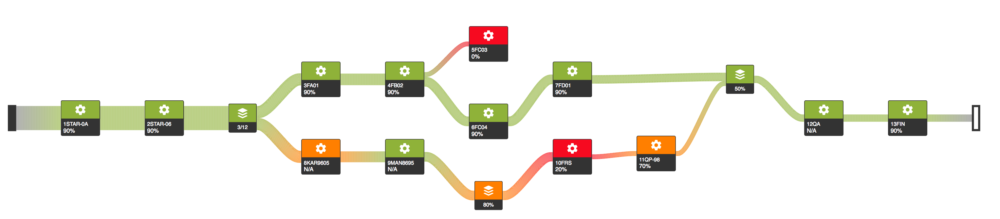

_Readme and wikis are work in progress._
# plv.js
JavaScript framework for creating Sankey diagrams with custom graphics.

# Specifics
## Supported diagrams
Diagrams that are supported can be characterized with following properties.

| Supported | Property | Elaboration |
| ------------- | ------------- | ------------- |
| ✅ Yes | Planar graphs  | "Planar drawings (or embeddings) make clear the structure of a given graph by eliminating crossing edges, which can be confused as additional vertices. Graphs defined by road networks, printed circuit board layouts, and the like are inherently planar because they are completely defined by surface structures." [1] |
| ✅ Yes | Non-planar graphs  | It should work. Haven't tested that one yet. 🤔 |
| ✅ Yes | Directed graph  | Graph should be directed. |
| ✅ Yes | Acyclic graph  | Graph should be acyclic (e.g. no feedback loops, no material refinement loops). |
| ❌ No | More than one entry point (i.e. source)?  | There should be only one entry point. Layouting algorithm will use it starting point. |
| ❌ No | More than one exit points (i.e. drains)?  | There should be only one drain point. Framework does not currently support this but it can be easily upgraded. |
| ❌ No | Orthogonal polyline drawings  | "Orthogonal means that all lines must be drawn either horizontal or vertical, with no intermediate slopes. Polyline means that each graph edge is represented by a chain of straight-line segments, connected by vertices or bends."[2].  Nodes can be connected only using relatively straight line that bends as it gets closer to the nodes (implemented using B-spline).  |

[1] Skiena, Steven S. “15.12 Planarity Detection and Embedding.” The Algorithm Design Manual, Springer, 2012, pp. 520–522.

[2] Skiena, Steven S. “15.10 Drawing Graphs Nicely.” The Algorithm Design Manual, Springer, 2012, pp. 513–516.

## Features

## Very general technical information

1. Has following dependancies
   * [d3.js](https://d3js.org/) 
   * [lodash](https://lodash.com/) 
   * [js-enumeration](https://github.com/MiroslavJelaska/js-enumeration)
2. Codebase is written in JavaScript ES6
3. Solution uses [webpack](https://webpack.js.org/)

# Usage and Implementation details
For usage and implementation details have a look at projects [📖 Wiki page](https://github.com/MiroslavJelaska/plv.js/wiki/1.-Home).

