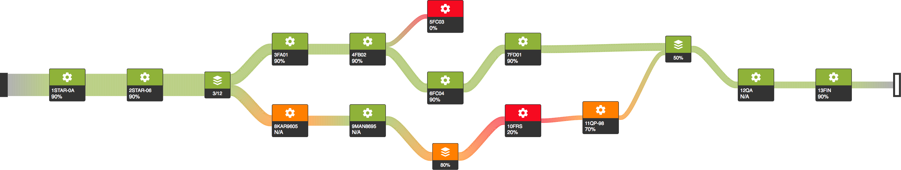

_Readme and wikis are work in progress._
# plv.js
JavaScript framework for creating Sankey diagrams with custom graphics.

# Setup
## How to run example project?
## How to include plv.js in my project?
## How to setup dev environment?

# API Details

# Contribute

